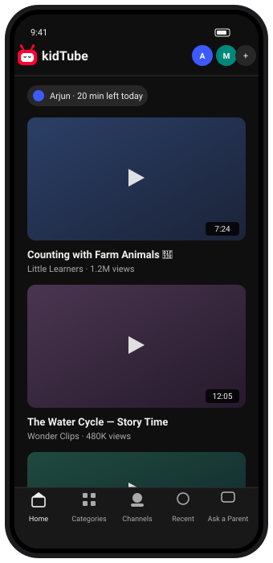
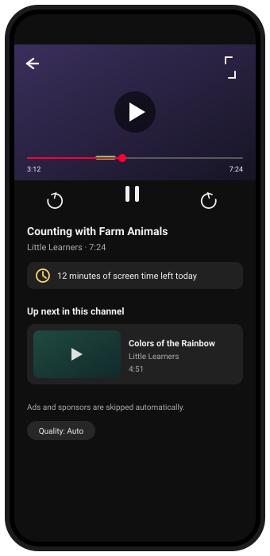
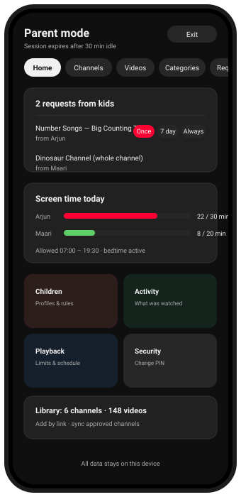
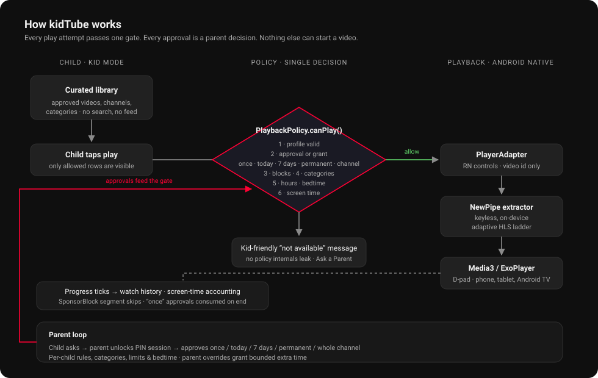

# kidTube


[](LICENSE)


<br/>

**A private, whitelisted video app for kids — built on React Native and a native Android player.**

kidTube plays YouTube content inside a walled garden: parents approve channels and videos,
children browse only what has been approved, and every play attempt passes a single policy gate.
No accounts, no ads, no recommendations, no tracking, no server — everything lives on the device.

<table>
  <tr>
    <td align="center" width="33%"></td>
    <td align="center" width="33%"></td>
    <td align="center" width="33%"></td>
  </tr>
  <tr>
    <td align="center"><b>Kid Mode</b><br/>curated library, per-child profiles</td>
    <td align="center"><b>Player</b><br/>adaptive HLS, SponsorBlock skips, screen-time aware</td>
    <td align="center"><b>Parent Mode</b><br/>PIN-gated approvals, rules and activity</td>
  </tr>
</table>

## Features

### For children
- **Kid Mode** — Home / Categories / Channels / Recently watched / Ask a Parent. Large cards,
  child-friendly copy, and nothing else: no comments, likes, subscriptions, external links,
  unrestricted search, or recommendations. Approved-library search stays on device.
- **Curated playlists** — parents create, rename and order collections; children can play or shuffle
  only their accessible videos. Queues stop at the end and respect the parent autoplay setting.
- **Multiple child profiles**, each with its own library view, limits, and rules.
- **"Ask a Parent"** — a child can request any video or channel they wish was available;
  the request lands in the parent's inbox. Nothing is playable until approved.
- **Android TV & tablet ready** — every interactive element has a visible focus ring,
  D-pad seeking, a D-pad PIN keypad, and media-key support.

### For parents
- **PIN-gated Parent Mode** with a 30-minute idle session. Authorization is enforced in the
  service layer, not by hiding buttons — parent-only calls fail without a live session.
- **Flexible approvals**: once (consumed when playback ends), today, 7 days, permanent,
  or a whole channel — globally or per child.
- **Per-child rules**: category allow/block, channel and video grants or blocks, and overrides
  of any family default (daily limit, allowed hours, bedtime, autoplay, SponsorBlock).
- **Screen time & schedule**: daily limits, allowed-hours windows, bedtime, warnings at
  10/5/1 minutes remaining, and bounded temporary overrides (+15 min, +30 min, until bedtime).
- **Content management**: paste a YouTube link or ID to save a candidate or approve it;
  approved channels sync their uploads (paginated, cached, quota-aware).
- **Offline downloads** — Parent Mode → Downloads saves approved videos at a selected quality
  for 7 or 30 days. Kid Mode → Recently watched → Saved for travel plays completed downloads.
  Files stay in private app storage excluded from Android backup. Saved videos still obey each
  child's current approvals, blocks, bedtime and daily viewing limit, including mid-playback expiry.
  Downloads can be cancelled or removed; expired files are cleaned up when the app runs.
- **Activity dashboard**: what each child watched, for how long, and every request made.

### Playback engine
- **Native Android module** (`modules/nestling-youtube-player`): Expo Module + Media3/ExoPlayer.
- **Keyless, on-device stream resolution** via the
  [NewPipe extractor](https://github.com/TeamNewPipe/NewPipeExtractor), feeding the adaptive
  HLS ladder — no API key and no third-party server.
- **Ad & sponsor skipping** through SponsorBlock categories configured by the parent.
- **Resilient playback**: bounded retry with exponential backoff, stream-expiry refresh,
  resume-at-last-position, and lifecycle-safe player release.
- **Player settings** — 0.25×–2× speed, available caption languages with normal/large text,
  and adaptive quality limits under a parent-set ceiling. Screen time counts actual viewing time
  at every speed. Captions and quality choices depend on the tracks available for each video.
- React Native owns the controls (play/pause, ±10s, scrubber, fullscreen, next-up);
  the native side only ever receives an approved **video ID**, never an arbitrary URL.

## How it works



One decision point governs everything. `PlaybackPolicy.canPlay()` evaluates, in order:

1. profile validity
2. an approval, child-specific grant, or temporary grant (expired grants report `APPROVAL_EXPIRED`)
3. child blocks (a block always wins)
4. disabled categories for this child
5. allowed hours / bedtime (unless a parent override grants schedule access)
6. screen time, including any live override bonus

`ContentAccessService` implements steps 1–4 and is shared by both the policy **and** the Kid
Mode library — so Kid Mode can never display something playback would refuse. Screens never
re-implement the rules; they only render kid-friendly results like
*"This video isn't available for your profile."*

## Privacy

- Local-first storage only: AsyncStorage + SecureStore. **No backend, no analytics, no ads,
  no tracking, no child profiling, no cloud sync.** Watch history never leaves the device.
- Metadata and stream URLs are resolved on-device. Streaming URLs remain in memory; the private
  Media3 download index retains source references needed to resume downloads. Saved media is
  never exported to shared storage or the gallery.
- The child never sees provider wording, error codes, or host names.

## Download (Android)

Grab the latest APK from
**[GitHub Releases →](https://github.com/surajmh/kidTube/releases/latest)**.

1. Download `app-release.apk` and install it (allow "install unknown apps" for your browser).
2. On first launch you create the **parent PIN** and the first **child profile** — start there.

> Android may ask you to allow installation from this source. Downloads use a foreground
> data-transfer service. Saving videos does not require shared-storage access.

## Getting started (development)

Requires a custom Android development build — this app uses a local native module, so **Expo Go
will not work**. You need JDK 17+ and an Android SDK.

```bash
npm install
npx expo prebuild
npx expo run:android        # debug build on a connected device or emulator
```

Build a distributable APK:

```bash
cd android && ./gradlew assembleRelease
# output: android/app/build/outputs/apk/release/app-release.apk
```

Checks and tests:

```bash
npm run typecheck
npm test                    # Jest + jest-expo; real modules, no network
```

## Project layout

```
App.tsx                                 app shell, screens, wiring
src/
  components/     KidHome, ParentShell + panels (requests, content,
                  categories, children, activity, security, override),
                  PinEntry, youtube/ (VideoCard, theme tokens), tv/ (focus)
  services/       playbackPolicy, contentAccess, approvals, requests,
                  categories, childRules, profilePolicy, screenTime,
                  sponsorBlock, channelSync, kidContentLibrary, …
  repositories/   AsyncStorage-backed persistence
  native/         YouTubePlayer bridge (React Native side)
modules/
  nestling-youtube-player/              Expo native module (Android, Kotlin)
    Media3/ExoPlayer controller · NewPipe-based playback resolver ·
    quality selector · channel/metadata fetchers · retry policy · D-pad view
tests/                                  policy, channel sync, security boundary tests
PHASE-*.md                              design docs per milestone
```

## Known limitations

- **Android only.** The playback engine is a local Android module; iOS is out of scope.
- **Daily screen time, allowed hours and bedtime follow the phone's clock.** A child who can change
  the date can start a new day. In Android settings, turn on **Automatic date & time** and keep
  children out of Date & time settings. The parent PIN lockout does not depend on the date: it is
  timed with the time since boot, so changing the date does not shorten it (a reboot falls back to
  the stored date).
- Content availability depends on YouTube's public endpoints (via NewPipe). Breakage in
  extraction is possible whenever YouTube changes, and is fixed by updating the extractor.
- Downloads need a connection until they show **Ready for travel**. Reopen the app to resume
  transfers interrupted by Android. Unavailable tracks or insufficient storage fail without
  creating a playable partial download. Offline playback uses only saved media, with no streaming
  fallback; captions are limited to embedded tracks saved with the video. Cached SponsorBlock
  segments can still be skipped offline.
- Only the adaptive HLS ladder is used for playback — keyless progressive streams are
  throttled by YouTube, so very old videos without HLS may not play.

## Disclaimer

kidTube is an independent, non-commercial family project. It is **not affiliated with,
endorsed by, or connected to YouTube or Google LLC**. "YouTube" is a trademark of Google LLC.
The app plays public content through the open-source
[NewPipe extractor](https://github.com/TeamNewPipe/NewPipeExtractor). Using it may be subject
to YouTube's Terms of Service; evaluate that for yourself and your family. All content rights
belong to their respective creators.

## License

kidTube is licensed under the **GNU Affero General Public License v3.0 only**
([`LICENSE`](LICENSE)). This is required by the
[NewPipe extractor](https://github.com/TeamNewPipe/NewPipeExtractor) the playback engine links,
and applies to the whole project: if you distribute a modified version (including over a network
service), you must release its complete corresponding source under the same license.

## Contributing

Issues and pull requests are welcome — especially around extraction resilience, Android TV
polish, and accessibility. Please run `npm run typecheck && npm test` before opening a PR.
